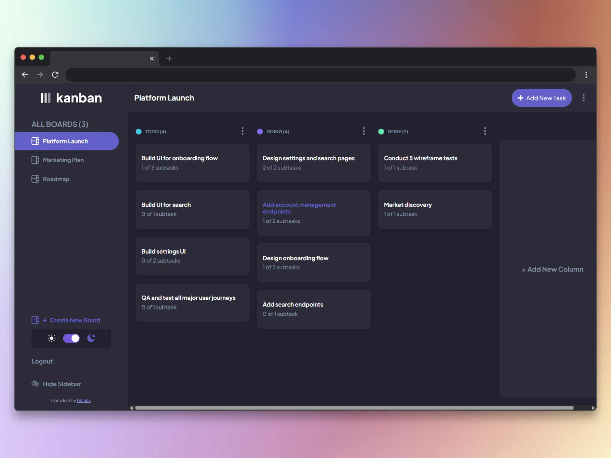

# Vector Kanban

**Enterprise Grade Production Kanban Board built with Nuxt 4, Postgres, and Supabase.**

**Live Demo:** 👉 [https://vector-kanban.netlify.app/](https://vector-kanban.netlify.app/)

[View Project Roadmap](./PROJECT_ROADMAP.md) · **[Future Board Roadmap](./ROADMAP.md)** · [View Detailed Progress Tracking](./PROJECT_PROGRESS.md)

A full-stack Kanban task management system developed under the **UrLabs** umbrella. Boards, columns, tasks, and subtasks persist in **Supabase PostgreSQL**, with drag-and-drop reordering backed by atomic server transactions and strict per-user data isolation.

Board and column lifecycles are **strictly decoupled**: board edits are **title-only**, while every column mutation (add, edit title, delete) flows through dedicated UI modals, Pinia actions, and isolated `/api/columns` endpoints—keeping state predictable and IDs in sync with the database.



---

## Nuxt 4 Architecture Stack

Vector Kanban follows **Nuxt 4** full-stack boundaries: a universal Vue application layer, a **Nitro 4** server engine, and a **Supabase**-hosted data plane with server-validated sessions.

### Board & Column Decoupling

Responsibilities are split by design so each layer has a single purpose:

| Layer | Scope | How it works |
|-------|--------|----------------|
| **Board** | Title only | Topbar **Edit Board** modal → `editBoard()` → `PATCH /api/boards/:id` with `{ title }` only. The API returns **400 Bad Request** if a `columns` payload is included. |
| **Columns** | Add / edit / delete | **Create Column** modal, per-column **Edit Column** / **Delete Column** modals → `addColumn`, `updateColumn`, `deleteColumn` → `POST`, `PATCH`, or `DELETE` on `/api/columns`. Responses return the full board graph so Pinia can merge official database UUIDs after optimistic client IDs. |

Column management was **removed entirely** from the board edit flow. Creating a board (`POST /api/boards`) may still seed initial columns at setup time; ongoing column changes never go through the board PATCH handler.

### Frontend & App Layer

| Concern | Implementation |
|--------|----------------|
| Routing & rendering | Nuxt 4 universal routing (`app/pages/`, `app/layouts/`) |
| UI framework | Vue 3 Composition API (`<script setup>`) |
| Styling | Tailwind CSS utility patterns + design tokens (`app/assets/main.css`) |
| Client state | Pinia stores (`board`, `ui`, `auth`) synced with `$fetch` API responses |
| Board vs. column modals | `edit-board` (title), `edit-column`, `create-column`, `delete-column` (isolated column flows) |
| Drag & drop | `vuedraggable` with optimistic Pinia updates + batch persist on drop |
| Auth UX | Global middleware (`app/middleware/auth.global.ts`), Supabase session hydration |

### Backend Engine

| Concern | Implementation |
|--------|----------------|
| Server runtime | **Nitro 4** (`server/api/`, `server/utils/`, `server/plugins/`) |
| ORM | **Drizzle ORM** — typed schema, relations, and transactional writes |
| Session resolution | `resolveSessionUser()` — `serverSupabaseUser` in production; `x-test-user-sub` when `NUXT_TEST=true` |
| API style | RESTful Nitro event handlers with consistent `401` / `403` / `400` error contracts |
| Board PATCH contract | Title-only updates; column writes rejected at `PATCH /api/boards/:id` |

### Database & Security

| Concern | Implementation |
|--------|----------------|
| Database | **Supabase PostgreSQL** via `DATABASE_URL` |
| Schema | `server/database/schema.ts` — boards, columns, tasks, subtasks with cascades |
| Tenant isolation | `user_id` on boards/columns; every mutation verifies ownership before read/write |
| Identity | Authenticated **`user.sub`** (UUID) from Supabase — never trust client-supplied user IDs alone |
| Migrations | `drizzle-kit push` against the Supabase connection string |

---

## Key Engineering Features Implemented

### Atomic Reordering Engine

Drag-and-drop movements persist through **`POST /api/tasks/reorder`**. The handler wraps all `order` and `columnId` updates in a single **Drizzle SQL transaction**, validating column ownership and task lineage before any write. Failed validation rolls back the batch; the client receives structured `403` / `404` responses instead of partial state.

### Tenant Data Isolation

Server routes enforce **relational ownership validation** on every protected endpoint. ID parameter spoofing is blocked: handlers resolve the session via `user.sub`, then confirm that boards, columns, and tasks belong to that identity before create, update, delete, or reorder operations.

### Atomic Subtask Handlers

Subtasks use **granular, single-responsibility** Nitro routes:

- `POST /api/subtasks` — create
- `PATCH /api/subtasks/[id]` — title and `is_completed` updates
- `DELETE /api/subtasks/[id]` — remove

Each handler validates the parent task chain back to an owned column, keeping subtask logic isolated from board/task bulk operations.

---

## Quality Assurance Framework

Automated **server integration tests** exercise real Nitro routes through **`@nuxt/test-utils`** (Nuxt 4 / Nitro 4 context), **Vitest**, and **happy-dom** as the DOM environment for module setup.

| Tool | Role |
|------|------|
| [Vitest](https://vitest.dev/) | Test runner (`npm run test`, `npm run test:watch`) |
| [@nuxt/test-utils](https://nuxt.com/docs/getting-started/testing) | `setup()` + `$fetch` against a built Nuxt server |
| happy-dom | `domEnvironment` in `vitest.config.ts` |
| Mocked auth | `NUXT_TEST=true` + `x-test-user-sub` header via `server/utils/session.ts` |
| In-memory DB | `server/utils/db.mock.ts` when testing without live Postgres |

**Example suites:** `tests/server/reorder.spec.ts`, `tests/server/columns.spec.ts` — ownership, validation, and reorder contracts.

```bash
npm run test
```

---

## Features

- **Full CRUD** — Boards, columns, tasks, and subtasks via Nitro API routes
- **Decoupled board & column flows** — Edit board title from the topbar; manage columns only via dedicated column modals and `/api/columns`
- **Optimistic column sync** — Client UUIDs on add are replaced when the API returns the authoritative board graph
- **Form validation** — Required fields; empty subtask rows must be filled or removed
- **Loading states** — `AppSpinner` on async actions; toasts via `vue-sonner`
- **Drag and drop** — Reorder within columns and move across columns with atomic persist
- **Responsive layout** — Mobile and desktop breakpoints
- **Dark / light mode** — Theme toggle with persisted preference
- **Sidebar** — Show/hide board navigation

---

## Tech Stack

| Layer | Technology |
|-------|------------|
| Framework | [Nuxt 4](https://nuxt.com/) |
| UI | [Vue 3](https://vuejs.org/) |
| State | [Pinia](https://pinia.vuejs.org/) |
| Server | Nitro 4 |
| ORM | [Drizzle ORM](https://orm.drizzle.team/) |
| Database | PostgreSQL ([Supabase](https://supabase.com/)) |
| Auth | [@nuxtjs/supabase](https://supabase.nuxtjs.org/) |
| Testing | Vitest, @nuxt/test-utils, happy-dom |
| Deployment | [Netlify](https://vector-kanban.netlify.app/) |

---

## Getting Started

### Prerequisites

- Node.js 18+
- A Supabase project (PostgreSQL + Auth)

### Environment

Create `.env` in the project root:

```env
DATABASE_URL=your_supabase_postgres_connection_string
SUPABASE_URL=your_supabase_project_url
SUPABASE_KEY=your_supabase_anon_key
```

### Database Schema

After updating `server/database/schema.ts`:

```bash
npx drizzle-kit push
```

Ensure `DATABASE_URL` points at your Supabase Postgres connection string before running the command.

### Install & Run

```bash
npm install
npm run dev
```

Open [http://localhost:3000](http://localhost:3000).

### Production

```bash
npm run build
npm run preview
```

---

## Project Structure

```
app/
  components/       # UI, modals, kanban columns/tasks
    modals/         # edit-board (title), edit-column, create-column, delete-column, …
  stores/           # Pinia (board, ui, auth)
  middleware/       # Global auth guard
  pages/            # Routes (home, login, settings)
server/
  api/              # Nitro REST handlers
    boards/         # Board CRUD (PATCH: title only)
    columns/        # Dedicated column CRUD
    tasks/          # Task CRUD + reorder
    subtasks/       # Subtask CRUD
  database/         # Drizzle schema & relations
  utils/            # db, session, auth, board fetch helpers
tests/
  server/           # API integration specs
  helpers/          # Shared @nuxt/test-utils setup
```

---

## API Endpoints

### Boards

| Method | Route | Description |
|--------|-------|-------------|
| `GET` | `/api/boards` | List boards with nested columns, tasks, subtasks (user-scoped) |
| `POST` | `/api/boards` | Create board and initial columns (setup only) |
| `PATCH` | `/api/boards/:id` | **Title only.** Body: `{ title }`. Returns full board. **`400`** if `columns` is sent—use column endpoints instead. |
| `DELETE` | `/api/boards/:id` | Delete board (cascades) |

### Columns (dedicated mutations)

| Method | Route | Description |
|--------|-------|-------------|
| `POST` | `/api/columns` | Create column on owned board; returns full board for store sync |
| `PATCH` | `/api/columns/:id` | Update column title; returns full board |
| `DELETE` | `/api/columns/:id` | Delete column and its tasks; returns full board |

### Tasks

| Method | Route | Description |
|--------|-------|-------------|
| `GET` | `/api/tasks` | List tasks |
| `GET` | `/api/tasks/:id` | Get single task |
| `POST` | `/api/tasks` | Create task with optional subtasks |
| `PATCH` | `/api/tasks/:id` | Update task / move column |
| `DELETE` | `/api/tasks/:id` | Delete task (cascades subtasks) |
| `POST` | `/api/tasks/reorder` | **Atomic batch reorder** (transaction) |

### Subtasks

| Method | Route | Description |
|--------|-------|-------------|
| `POST` | `/api/subtasks` | Create subtask |
| `PATCH` | `/api/subtasks/:id` | Update subtask title / completion |
| `DELETE` | `/api/subtasks/:id` | Delete subtask |

---

## Scripts

| Command | Description |
|---------|-------------|
| `npm run dev` | Development server |
| `npm run build` | Production build |
| `npm run preview` | Preview production build |
| `npm run test` | Run Vitest server integration suite |
| `npm run test:watch` | Vitest watch mode |

---

## Documentation & Roadmap

| Document | Purpose |
|----------|---------|
| **[ROADMAP.md](./ROADMAP.md)** | **Future board features** — metadata & timestamps, collaboration & roles, custom themes/backgrounds, activity & audit logs |
| [PROJECT_ROADMAP.md](./PROJECT_ROADMAP.md) | Phased delivery status (Phases 1–8) and platform-wide vision |
| [PROJECT_PROGRESS.md](./PROJECT_PROGRESS.md) | Granular checklist of completed work |

The decoupled board/column architecture in this README is the baseline for the enhancements tracked in **[ROADMAP.md](./ROADMAP.md)**.

---

## License

Design assets from [Frontend Mentor](https://www.frontendmentor.io) are for personal use only and must not be redistributed.
